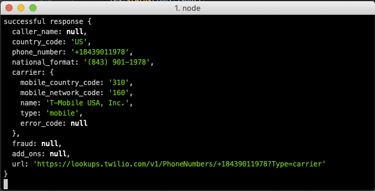

# Node.js - Zero to Hero:  Adding Account Security to your Stack

Simple Node app adding Lookup and Verify to your stack to help identify your users and prevent fraudsters from abusing your stacks.

#### Setup and Run Instructions
- Git clone
- ```npm install```
- ```cp demo.env.example demo.env```
- Login to Twilio Console
- Add Twilio Account SID and Auth Token to demo.env
- Browse to https://www.twilio.com/console/verify/services
- Create a Verify Service.  Name it appropriately
- Add new Verify Service SID to demo.env
- Browse to https://www.twilio.com/console/authy/applications
- Create an Authy application
- Copy Authy API Key to demo.env
- ```source demo.env```
- ```npm start```
- Browse to localhost:1337


#### Verification Flow
- Prompt user for country code and phone number.
- Click to Lookup Phone Number
- Execute a Lookup.  This detects the line-type (voip,mobile,landline)
- Request Verification Code.
    - If mobile, send OTP via SMS.
    - If landline, send OTP via voice call.
    - If VOIP, don't allow registration.
- If appropriate line-type, send them a Verification code.
- Prompt user for OTP.
- Verify OTP.
- Success!

#### Account Creation Flow
- Add Username, Email address, Country Code and Phone number
- Add password.  
    - Note, we override the password on the backend for demo purposes
- Click Lookup
    - Note, only mobile numbers are allowed to register.  No VOIP, No landlines.
- Click Register
    - Note, you can not re-use the same username.
    - Check db.json if you're having trouble.
- The backend will register the user with Authy and prompt you 
- If you have Authy, the Signal 2019 Authy app will be added to your Authy application.
    - Use TOTP or Push for 2FA verification with Authy
    - Use SMS or Voice if you do not have the Authy app
- Once you verify, you've now added 2FA to your user account.

#### Login with 2FA
- Using the username and password created in the Account Creation Flow, login.
- Select your 2FA mechanism.
- Provide 2FA.

#### Database
- We've setup a flat file database with JSON
- The database format looks like this:
```
{
  "users": {
    "username": {
      "cc": "1",
      "pn": "5551235678",
      "authyid": 12345,
      "password": "pass",
      "email": "youremail@twilio.com"
    },
    ...
  }
}
```
- Database entries are only added when creating an account.
- Authy ID registration is for the stretch goal of adding Authy

#### Console Output
Monitor your console for feedback during dev as well.


